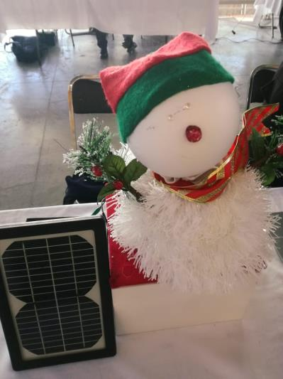

# Snowy — Voice-Controlled Christmas Animatronic (ESP32)

<p align="center">
  
</p>

> **Historical repository.** This repository preserves the original implementation of the project. The source code has intentionally not been refactored or modernized in order to retain the historical context and original development approach. The source code represents the original implementation developed during my university studies.

## Project Overview

**Snowy** is a small snowman-shaped Christmas animatronic built in about one week by a three-person, multidisciplinary student team. An **ESP32** board runs a tiny HTTP server on the local Wi-Fi network. An **Android app built with MIT App Inventor** listens for Spanish voice commands and sends them to the ESP32 as JSON in the request URL. The firmware then moves servomotors, plays pre-recorded 8 kHz audio through the ESP32 DAC, and (in the report's version) drives RGB LED "eyes". The system runs on a **solar panel** that charges a 12 V lead-acid battery.

This repository contains the ESP32 firmware sketch (`control.ino`), the embedded audio data (`SoundData.h`), the Arduino libraries the team used (as ZIP archives), and the original project report (PDF, in Spanish).

## Project Context

| | |
|---|---|
| **Project origin** | Academic / University Project (**Confirmed**) |
| **Institution** | Universidad de Guadalajara, Centro Universitario de Ciencias Exactas e Ingenierías (CUCEI), División de Electrónica y Computación, Departamento de Ciencias Computacionales |
| **Program** | "DIVEC Innovación 2019": modular-project challenge (*Reto de Proyectos Modulares*) |
| **Purpose** | To earn credit for the *proyectos modulares* of three degree programs: Communications & Electronics (INCE), Robotics (INRO) and Photonics (IGFO) |
| **Team** | Omar Baruch Morón López, Brenda Isabel Estrada Hernández, David Alejandro Rodríguez Preciado |
| **Advisor** | Juan Carlos Aldaz Rosas |
| **Date** | Report dated 5 December 2019 (Guadalajara, Jalisco). Files uploaded to GitHub on 20 February 2021. |

See [docs/project-context.md](docs/project-context.md) and [docs/assignment.md](docs/assignment.md).

## Problem Statement

The challenge asked for an **animatronic powered by a sustainable energy source**, with **minimal and energy-efficient circuitry**, **controlled lighting**, **at least two degrees of freedom of movement**, and **community reach**. Teams had **one week**.

The team added a social-impact angle: most Christmas animatronics are purely visual, so Snowy was designed so that **blind and visually impaired people** could also use it through **voice commands on their phone**. The report cites INEGI 2010 figures on visual disability in the Guadalajara metropolitan area to support this goal.

## Objective

Build a sustainable, inclusive Christmas decoration that can:

- be powered by a solar panel with battery storage;
- receive voice commands from an Android phone over Wi-Fi;
- move (dance, nod "yes", shake head "no", wave);
- play Christmas music and spoken phrases (e.g. how many weeks remain until Christmas);
- run RGB lighting sequences.

## Repository Structure

```
.
├── README.md                     ← you are here
├── AGENTS.md                     ← rules for automated contributors (code is frozen)
├── LICENSE                       ← MIT (original, 2021)
├── src/
│   └── control/                  ← original Arduino sketch folder (unchanged files)
│       ├── control.ino           ← ESP32 firmware: Wi-Fi, HTTP/JSON, servos, audio
│       └── SoundData.h           ← WAV audio clips embedded as C byte arrays
├── third_party/
│   └── arduino-libraries/        ← library ZIPs shipped with the original project
│       ├── ArduinoJson.zip                          (v5.7.1)
│       ├── ESP32-Arduino-Servo-Library-master.zip   (ServoESP32 v1.0.1)
│       └── XT_DAC_Audio-4_2_1.zip                   (XT_DAC_Audio 4.2.1)
└── docs/
    ├── project-context.md        ← origin, timeline, scope, evidence
    ├── assignment.md             ← challenge requirements and how they were met
    ├── report.md                 ← English technical summary of the original PDF
    ├── architecture.md           ← system components and data flow
    ├── code-overview.md          ← walkthrough of control.ino and SoundData.h
    ├── possible-improvements.md  ← known issues (NOT applied)
    ├── sdlc/                     ← intent.md, spec.md, plan.md (reconstructed)
    ├── images/                   ← figures extracted from the original report
    └── original/
        └── ReporteRetoProyectoModularDIVEC.pdf   ← original report (Spanish)
```

The sketch lives in `src/control/` because the Arduino IDE requires a sketch to sit in a folder with the same name as its `.ino` file.

## Original Implementation

The files in `src/control/` are **byte-for-byte identical** to the files originally uploaded in 2021. They were only moved into a folder. Nothing was changed: no logic, formatting, names, comments, or bugs.

**Important:** the code in this repository **does not compile as-is**. It contains syntax errors and a missing audio symbol. It also **differs from the firmware listing printed in the report's annex**. The report version includes RGB LED control and head movements that this file does not have. These differences are part of the historical record. They are documented, not fixed. See [docs/code-overview.md](docs/code-overview.md#differences-between-the-repository-code-and-the-report-annex) and [docs/possible-improvements.md](docs/possible-improvements.md).

## Technologies

All of these are identified directly from the code, the library archives, or the report:

- **Hardware:** ESP32 dev board, 3 × SG90 9 g servomotors, 2 × RGB LEDs (report), LM386 audio amplifier plus a 3 W speaker, monocrystalline solar panel (18 V max / 50 W, as stated), 12 V 7 Ah lead-acid battery, LM317 charge regulator, TIP122, LM7805 5 V regulator
- **Firmware:** Arduino (C++) for ESP32, using the Arduino IDE
- **Libraries:** `WiFi.h` and `time.h` (ESP32 core), [ArduinoJson](https://github.com/bblanchon/ArduinoJson) 5.7.1, ServoESP32 1.0.1 (Jaroslav Paral), XT_DAC_Audio 4.2.1 (XTronical)
- **Mobile app:** MIT App Inventor (Android): SpeechRecognizer, TextToSpeech, Web, LocationSensor, Camera, ContactPicker, PhoneCall
- **External services:** NTP (`pool.ntp.org`) on the ESP32, OpenWeatherMap API from the app
- **Audio tooling:** Audacity (resample to 8 kHz mono, unsigned 8-bit PCM) and `xxd -i` (WAV to C array)

## How It Works

1. On boot, the ESP32 connects to a hard-coded Wi-Fi network, syncs the time over NTP, starts an HTTP server on port 80, and attaches three servos (GPIO 18, 19, 21).
2. The user presses the microphone button in the Android app and says a command (in Spanish), for example *"baila"*, *"música"*, *"sí"* or *"luces"*.
3. The app maps the recognized text to a URL of the form `http://<esp32-ip>/{"musica":"musica"}` and sends a GET request.
4. The firmware reads the HTTP request line, removes `GET /` and ` HTTP/1.1`, URL-decodes `%22`, `%7B` and `%7D`, and parses the result with ArduinoJson.
5. Each recognized key triggers an action: `musica` plays the embedded "bells" song through the DAC (GPIO 25), and `baila` sweeps a servo back and forth. Many other keys are handled as empty placeholders in this version.
6. The ESP32 replies `HTTP/1.1 200 OK` / `OK` and closes the connection.

Details: [docs/architecture.md](docs/architecture.md) · [docs/code-overview.md](docs/code-overview.md)

## Inputs and Outputs

| Direction | What |
|---|---|
| Input | HTTP GET requests whose path is a URL-encoded JSON object (e.g. `/%7B%22baila%22:%22baila%22%7D`) |
| Input | NTP time (printed to serial only) |
| Output | Servo motion (PWM on GPIO 18/19/21) |
| Output | Analog audio on DAC GPIO 25 to the LM386 amplifier and speaker |
| Output | Serial log at 115200 baud |
| Output | A plain `OK` HTTP response |

## Running the Project

The original repository **does not provide build instructions**, and the code **does not compile unchanged** (see above). Here is what can be stated reliably:

- Target: an ESP32 board in the **Arduino IDE** (the report names the Arduino IDE as the firmware environment).
- Libraries: install the three ZIPs from `third_party/arduino-libraries/` with *Sketch → Include Library → Add .ZIP Library*. The ArduinoJson ZIP is **v5**, and the code relies on the v5 API (`StaticJsonBuffer`). ArduinoJson v6 or later will not work with it.
- Open `src/control/control.ino`. `SoundData.h` must stay in the same folder.

The exact ESP32 Arduino-core version, board variant and IDE version used in 2019 are **Unknown**. The Android app's source (`.aia`) and APK are **not included** in this repository. Its block code survives only as screenshots in the report (see [docs/report.md](docs/report.md#mobile-application)).

## Documentation

- [Project context](docs/project-context.md): origin, timeline, evidence, what is confirmed, inferred or unknown
- [Assignment](docs/assignment.md): DIVEC 2019 challenge requirements and compliance
- [Report summary](docs/report.md): English technical summary of the original Spanish report (hardware, circuits, app, audio pipeline)
- [Architecture](docs/architecture.md): components and data flow
- [Code overview](docs/code-overview.md): file-by-file and function-by-function walkthrough
- [Possible improvements](docs/possible-improvements.md): known bugs and modernization ideas (not applied)
- Reconstructed development artifacts: [intent](docs/sdlc/intent.md) · [spec](docs/sdlc/spec.md) · [plan](docs/sdlc/plan.md)
- Original report (PDF, Spanish): [docs/original/ReporteRetoProyectoModularDIVEC.pdf](docs/original/ReporteRetoProyectoModularDIVEC.pdf)

## Historical Note

This repository was later reorganized and documented to improve readability and preserve the historical context of the original project. The original source code remains unchanged. All Markdown files, the `docs/images/` figures (extracted from the original PDF), `AGENTS.md` and `.gitignore` were added during this reorganization. Everything else is original material.

## License

[MIT](LICENSE) © 2021 Baruch Lopez. Third-party libraries in `third_party/` remain under their authors' terms (ArduinoJson and ServoESP32 include a license file inside their archive; the XT_DAC_Audio archive does not include one).
