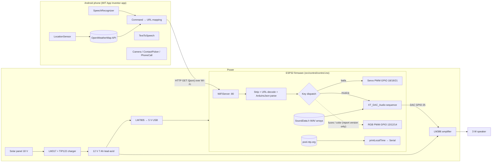

# Architecture

← Back to [README](../README.md)

Snowy is a small system. Its "architecture" is one phone app talking to one microcontroller over HTTP on a local Wi-Fi network, plus the power and audio electronics around them. Nothing here should be read as layers, services or patterns beyond what the files show.

## System Overview



Solid arrows are behavior present in the repository code or clearly described in the report. The dotted arrow is present **only** in the report's annex firmware, not in `src/control/control.ino`.

## Components

| Component | Where it lives | Responsibility | Status |
|---|---|---|---|
| Android app | *Not in repository* (screenshots in the report) | Voice recognition, TTS, weather, time, selfie, calls, sending commands | Confirmed from report; source unavailable |
| HTTP command server | `control.ino`: `setup()`, `loop()`, `ReadIncomingRequest()` | Accept one client at a time, read the request line, reply `OK` | Confirmed |
| Command decoder | `control.ino`: `loop()` | Remove the `GET /` prefix and ` HTTP/1.1` suffix, decode `%22 %7B %7D`, parse JSON (ArduinoJson v5) | Confirmed |
| Motion | `control.ino`: `servos[]`, `setServos()` | Drive 3 SG90 servos | Confirmed |
| Audio engine | `control.ino` + `SoundData.h` + XT_DAC_Audio | Queue WAV clips and stream them to DAC 25 | Confirmed |
| Time | `control.ino`: `printLocalTime()` | NTP sync, print to serial | Confirmed |
| Lighting | Report annex only | RGB PWM sequences | Confirmed in report; absent from repo code |
| Power | Hardware only | Solar charging, 12 V storage, 5 V regulation | Confirmed from report |

## Communication Protocol

The protocol is **HTTP/1.1 GET with a JSON object in the path**. There is no query string and no body.

```
App  →  GET /%7B%22musica%22:%22musica%22%7D HTTP/1.1     (App Inventor may send quotes raw or as %22)
ESP32:  "GET /{"musica":"musica"} HTTP/1.1"
        remove(0,5)            → "{"musica":"musica"} HTTP/1.1"
        remove(len-9, 9)       → "{"musica":"musica"}"
        replace %22 %7D %7B    → JSON text
        parseObject()          → objetoJSON["musica"] == "musica"
ESP32 → "HTTP/1.1 200 OK\r\nContent-Type: text/html\r\n\r\n\r\n\r\nOK\r\n\r\n"
```

Keys understood by the **repository** firmware: `hora`, `clima`, `hola`, `luces`, `baila`, `no`, `si`, `musica`, `cuantofaltaparanavidad`, `selfie`. Only `musica` and `baila` do anything. The rest are empty placeholders.

## Pin Map

| GPIO | Use | Source |
|---|---|---|
| 18, 19, 21 | Servo 0, 1, 2 | Repo code and report |
| 25 | DAC audio out (`XT_DAC_Audio_Class DacAudio(25,0)`) | Repo code |
| 23 | `ledVerde` (configured as output, never written) | Repo code |
| 13 / 12 / 14 | RGB LED R / G / B (PWM) | Report annex only |

## Runtime Model

A single-threaded Arduino `loop()`:

1. `DacAudio.FillBuffer()` refills the audio buffer.
2. Check for a client. If there is none, return (so the audio buffer is refilled on the next pass).
3. If there is a client, busy-wait until data arrives, read and handle the command (which may block for several seconds on `delay()` calls), then respond and close.

Audio therefore only plays smoothly while no request is being processed. See [possible-improvements.md](possible-improvements.md).
