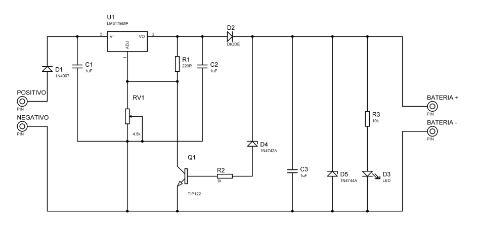
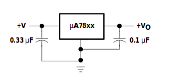
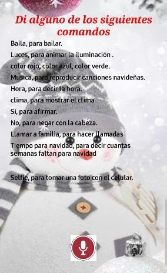
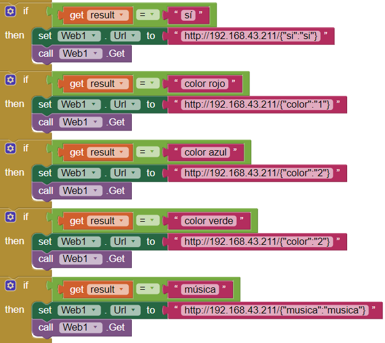
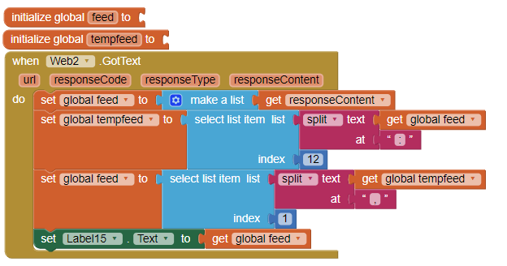
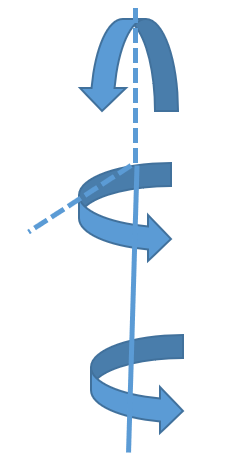
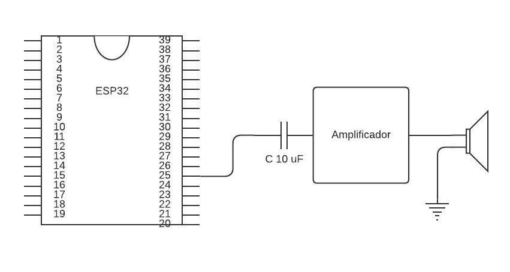

# Original Report: Technical Summary (English)

← Back to [README](../README.md)

This is a structured English summary of the original Spanish report, **"Reporte Reto Proyecto Modular DIVEC"** (37 pages, dated 5 December 2019). It is not a literal translation. It was built from the extracted text and a visual review of every figure, table, schematic and screenshot. The original is preserved unchanged at [`original/ReporteRetoProyectoModularDIVEC.pdf`](original/ReporteRetoProyectoModularDIVEC.pdf).

Figures reproduced in [`images/`](images/) were extracted from that PDF without modification.

---

## Contents

1. [Introduction & problem](#1-introduction--problem)
2. [Justification & hypothesis](#2-justification--hypothesis)
3. [Methodology](#3-methodology)
4. [Embedded system: ESP32](#4-embedded-system-esp32)
5. [Power subsystem](#5-power-subsystem)
6. [Mobile application](#mobile-application)
7. [Wi-Fi / JSON communication](#7-wi-fi--json-communication)
8. [Actuators (servos)](#8-actuators-servos)
9. [Lighting (RGB LEDs)](#9-lighting-rgb-leds)
10. [Audio playback](#10-audio-playback)
11. [Conclusion](#11-conclusion)
12. [References cited](#12-references-cited)
13. [Annexes](#13-annexes)

---

## 1. Introduction & problem

- Snowy is a Christmas-themed animatronic built to earn credit for the modular projects of INCE, IGFO and INRO within **DIVEC Innovación 2019** (see [assignment.md](assignment.md)).
- Problem statement: Christmas animatronics are usually purely decorative (singing, talking, dancing). The team wanted **social impact**: Snowy targets the general public, with special emphasis on **blind people**, who cannot enjoy the visual design but can use its functions from a phone.
- Sub-problems listed by the report:
  - *Animatronic:* obtain an audio amplifier; develop a voice-command mobile app; establish communication between the phone app and the microcontroller; convert voice clips to hexadecimal for playback; find a cheap, practical housing.
  - *Energy:* find a solar panel (or array) able to charge a battery; design a voltage regulator; design a voltage indicator matched to the battery.

## 2. Justification & hypothesis

- The report cites **INEGI (2010)** as saying that almost 30% (≈70,000 people) of the disabled population in the Guadalajara metropolitan area is visually impaired, the second most common disability. *(Figure reproduced as stated; not verified here.)*
- From the phone's default setup, a single button opens the app. The user can then ask for the time, date, days left until Christmas, weather, call a relative, play music (a Christmas carol), take a selfie, and control lighting.
- State of the art: the report distinguishes an **animatronic** (pre-recorded movements and sounds) from a **robot** (responds to stimuli, may include AI). Snowy is classified as an animatronic because its "brain" is a single microcontroller.
- Hypothesis: an animatronic can be **fully sustainable and inclusive**, applying technology to a social cause rather than only decoration.

## 3. Methodology

A six-day plan (summarized in [project-context.md](project-context.md#timeline-from-the-reports-methodology)). Audio amplification and noise were the most time-consuming problems.

## 4. Embedded system: ESP32

- **Board:** Espressif ESP32 (SoC with integrated Wi-Fi 802.11 b/g/n and Bluetooth 4.2; Tensilica Xtensa LX6).
- **Why it was chosen:** Wi-Fi for receiving commands, a **DAC** for audio playback, and **PWM** channels for the RGB LEDs and servo positioning.
- **Characteristics listed:** Micro-USB / 5 V or 3.3 V supply, enable button, 12-bit ADC with 18 channels, two DACs, 39 GPIOs (34–39 input-only), VSPI/HSPI/I²C/UART, 16 PWM channels.
- *Note:* the report states a maximum clock of "24 MHz". This is likely a typo for 240 MHz (Inferred).

## 5. Power subsystem

### 5.1 Energy acquisition

- **Solar panel:** monocrystalline, 30 cm × 18 cm, **18 V max** (midday sun), stated **50 W** max. Measured with a multimeter: 18 V in sun, about 8 V under indoor artificial light.
- Background on photovoltaics, batteries and inverters is included (no inverter is used in the build).

### 5.2 Storage: battery charger

- **Battery:** 12 V, 7 Ah lead-acid (chosen because it was available).
- The report explains the four lead-acid charge stages: **Bulk** (max current up to about 14.4–14.8 V, 80–90% charge), **Absorption**, **Float** (12.9–14 V for flooded batteries) and **Equalization**.
- **Circuit:** adjustable **LM317** regulator. A **TIP122** transistor on the ADJ pin cuts current to near zero once the upper voltage limit is reached, and an **LED** indicates that limit (Zener diodes set the thresholds).

| Component | Qty |
|---|---|
| LM317 regulator | 1 |
| TIP122 | 1 |
| 1N4007 diode | 1 |
| Capacitor 0.1 µF / 25 V | 1 |
| Capacitor 220 µF / 25 V | 1 |
| Trimmer 4.5 kΩ | 1 |
| Resistor 220 Ω | 1 |
| Resistor 1 kΩ | 2 |
| LED | 1 |
| 5 A diode | 1 |
| Zener 12 V | 1 |
| Zener 15 V | 1 |
| Capacitor 1000 µF / 25 V | 1 |

### 5.3 Regulation

- The battery gives 12 V and the ESP32 needs 5 V. An **LM7805** provides 5 V, delivered to the ESP32 **through its USB connector**. The output was verified with a multimeter at maximum battery voltage.
- Components: LM7805 and two capacitors (table says "10 mF" and "0.1 mF"; the figure shows 0.33 µF input and 0.1 µF output).

## Mobile application

- **Platform:** Android, chosen for market share (the report cites StatCounter, Jan 2018–Jan 2019: 74.45% Android vs 22.85% iOS).
- **Environment:** **MIT App Inventor** (CC BY-SA 3.0), built into an **APK** and installed on the phone.
- On start-up the main screen lists the available voice commands visually and by speech ("Hola soy snowy", meaning "Hi, I'm Snowy"). A microphone button starts speech recognition.
- **Device permissions used:** microphone (speech recognition), contacts and calls, clock, Wi-Fi, geolocation (weather).

### Voice commands

The recognized phrases are Spanish. The table below is reconstructed from the report text and the App Inventor blocks in the annex (page 28).

| Spoken command | Category | App action | HTTP request sent to ESP32 |
|---|---|---|---|
| "hora" | App + animatronic | Speak and display the current time | `{"hora":"<formatted time>"}` |
| (weather, triggered from the same flow) | App + animatronic | Call OpenWeatherMap by GPS, parse the temperature, display it | `{"temperatura":"<value>"}` |
| "Hola" | Animatronic | Speak "hola, soy snowy" | `{"saludo":"saludo"}` |
| "baila" | Animatronic | Dance | `{"baila":"baila"}` |
| "no" | Animatronic | Shake head | `{"no":"no"}` |
| "sí" | Animatronic | Nod | `{"si":"si"}` |
| "color rojo" / "color azul" / "color verde" | Animatronic | Set LED color | `{"color":"1"}` / `{"color":"2"}` / `{"color":"2"}` *(azul and verde both send "2" in the screenshots)* |
| "música" | Animatronic | Play Christmas song | `{"musica":"musica"}` |
| "luces" | Animatronic | Light sequence | `{"luces":"luces"}` |
| "tiempo para Navidad" | Animatronic | Play "weeks until Christmas" | `{"cuantofaltaparanavidad":…}` |
| "selfie" | App | Open the front camera and take a picture | `{"selfie":"selfie"}` |
| "Llama a familia" | App | Pick a contact and call them | — |

The text also mentions "bailar + number" to select one of several predefined dances. That variant is not visible in the annex blocks.

### Weather data

The app requests `data/2.5/weather` from OpenWeatherMap with the phone's latitude and longitude. It splits the JSON response text to extract the temperature, shows it in a label, and forwards it to the ESP32.

Full block listing from the annex: [images/app-inventor-full-blocks.png](images/app-inventor-full-blocks.png).

## 7. Wi-Fi / JSON communication

- Wi-Fi was chosen over Bluetooth for bandwidth and range, so anyone on the home network can interact with Snowy.
- **"Security":** the report states that encoding requests as JSON adds security against unauthorized control. *(Technically this is only a message format, not authentication or encryption. See [possible-improvements.md](possible-improvements.md).)*
- **Decoding steps described:**
  1. Strip the non-required part of the URL (`http://IP/`).
  2. URL-decode non-alphanumeric characters (e.g. `%7B"color":"1%7D` → `{"color":"1}`).
  3. Parse the JSON and assign values (e.g. `color = 1`).
- The ESP32 is addressed as `http://192.168.43.211/`.

## 8. Actuators (servos)

- **3 × SG90 (9 g)** micro-servos arranged to give rotation about three axes (Figure 12).
- Configured with `#include <Servo.h>` on **GPIO 18, 19, 21**. The annex comments say servo 1 is the "BASE 0-90" and servo 2 moves "0-110".
- Movements shown: **greeting** (servo1 → 0°, servo2 → 90°), **no** (servo2 0° → 120°), **yes** (servo1 0° → 120°), each with 1 s delays.

## 9. Lighting (RGB LEDs)

- RGB LEDs as the snowman's **eyes**, wired in **series** so that both show the same color.
- PWM via `ledcSetup` / `ledcAttachPin`: **R = GPIO 13, G = GPIO 12, B = GPIO 14**, 5 kHz, 8-bit, channels 0/1/2.
- Sequences: white when the app connects; a color and blink pattern for greeting; a distinct sequence per voice command.

## 10. Audio playback

- Two audio paths: **local** (ESP32 DAC to amplifier to speaker) and **on the phone** (text-to-speech).
- Recorded clips: *faltan*, *para*, *semanas*, *navidad*, numbers, and Christmas songs. These are concatenated to say how many weeks remain until Christmas.
- **Wiring:** DAC output, then a 10 µF coupling capacitor, then the amplifier, then a **3 W** speaker.

### Amplifier (LM386)

Externally powered (12 V) so that it does not load the ESP32.

| Component | Qty |
|---|---|
| LM386 | 1 |
| Potentiometer 10 kΩ (on the input, feeding pin 3) | 1 |
| Resistor 10 kΩ (in series with the 0.05 µF capacitor, output to ground) | 1 |
| Capacitor 250 µF (output coupling to the speaker) | 1 |
| Capacitor 0.05 µF | 1 |

### WAV to C array pipeline

1. Edit each clip in **Audacity**: resample to **8000 Hz**, mix to **mono**, and export as **WAV, unsigned 8-bit PCM**.
2. Convert with `xxd -i file.wav out.hex` to get a `unsigned char name[] = {…}` array and its length.
3. Collect all arrays in a library header (`SoundData.h`), with the exact byte length written in each array's size.
4. Play with **XT_DAC_Audio**: create `XT_Wav_Class` objects, queue them in an `XT_Sequence_Class`, and call `DacAudio.FillBuffer()` at the start of every `loop()`.

The WAV headers in the repository's `SoundData.h` confirm this format: every clip is RIFF/WAVE, 1 channel, 8000 Hz, 8-bit.

## 11. Conclusion

The team reports that they verified, tested and implemented the required circuits: solar source, minimal conversion circuitry into a lead-acid battery, an Android app with Wi-Fi communication and JSON-based "encryption", external data retrieval (weather), three-channel RGB lighting control, "three degrees of movement using two servomotors" (see the contradiction noted in [project-context.md](project-context.md#contradictions-found)), and audio playback.

## 12. References cited

AutoSolar (2015, two articles on lead-acid batteries); Barton (2007, clean-energy IP); Casas (2019, PCWorld, iPhone vs Android share); García (2017, El Español / Omicrono, animatronics industry); INEGI (2010, disability); Intel (2019, Wi-Fi protocols); MIT App Inventor "About Us"; Sparkfun (2003, LM7805 datasheet); Espressif Systems (2019, ESP32 datasheet); Weigert (1997, `xxd` man page).

## 13. Annexes

- **App Inventor code** (page 28): full block diagram, image only. See [images/app-inventor-full-blocks.png](images/app-inventor-full-blocks.png).
- **ESP32 firmware listing** (pages 29–36): a **different version** from `src/control/control.ino`. The differences are listed in [code-overview.md](code-overview.md#differences-between-the-repository-code-and-the-report-annex).
- **Photographs** (page 37): the team with the finished prototype, the snowman with its solar panel, and breadboard assembly. See [images/snowy-final-prototype.jpg](images/snowy-final-prototype.jpg).
